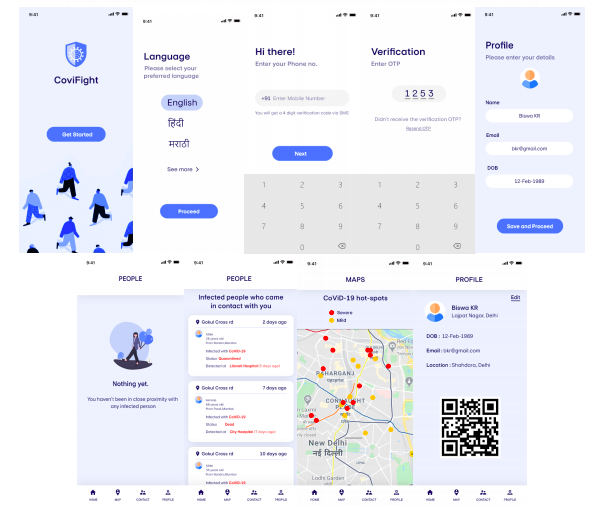
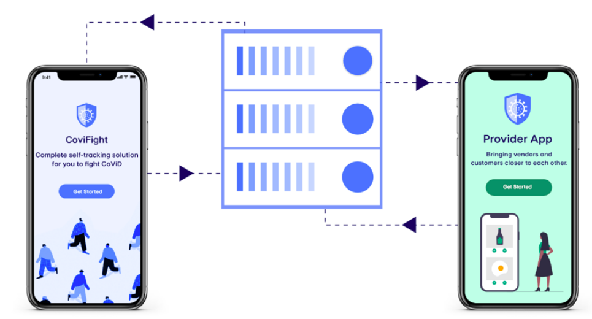

# CoviFight

The virus has affected humanity in various ways, be it our economy, our freedom of movement and the loss of loved ones. Then how do we live on, comfortably and safely with this virus around?

CoviFight alerts me about the risks of catching the virus of me if I have come in contact with these people within the past three weeks. It also informs the healthcare system accurately about the spread of infection.

CoviFight is a three-tier system:
1) user's app
2) provider's app 
3) Official's portal.

While utilising Bluetooth and GPS of your phone, CoviFight makes sure that the confidentiality of every individual is secured and can not be compromised. Data is encrypted using a secret key, and no one can view it without your permission. It only traces the past data of positively tested patients. This way, CoviFight also meets the GDPR compliance. 
By using Geo-fencing and machine learning, CoviFight predicts your chances of catching the infection so that you can take preventive measures.

#### Provider's app 
This app is the key to the detection of infected areas, be it a vehicle or a workplace. This app is very similar to the user's app; the key difference being the accessibility of the stored data. It stores data about all the people who visited a store or travelled a bus.

Suppose MacDonald's installs CoviFight. It would store the information of all the customers they had for a day. If it had infected customers in the past 15 days, McDonald's would get alerted, and they can sanitize their store to keep their customers safe. The app collected the unique ids of all their customer, making it possible to backtrace and warn their customers.

#### Official's portal 
It is a website for doctors and government officials to update the status of a person. It facilitates the doctors and government officials to examine the situation by providing a graphical visualization of the analytics performed.
The app generates heat maps with places where there are possible traces of the virus, so that people can prevent travelling at these places and authorities can sterilise or lockdown these places efficiently rather than imposing a complete lockdown of the nation.

The app also generates a map with hotspots for what places have virus traces, so that people can prevent travelling at these places and authorities can sterilise or lockdown these places efficiently.

Project Pitch:  https://youtu.be/kz78VzYkqjo

Project Demo:   https://www.youtube.com/watch?v=4HPo3nUarWc
